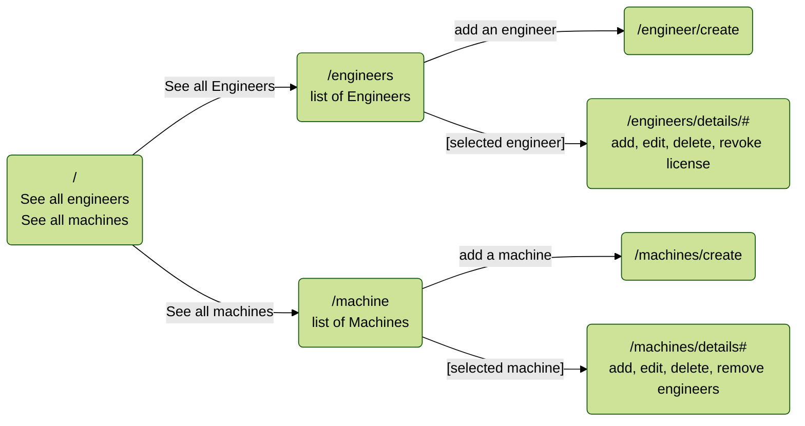

# Dr. SillyStringz's Factory

#### _By John Diggins_
  

## Technologies used
* .NET 7.0.3
* C #
* EF Core
* Razor
* HTML
* CSS

## Description
A website to build your own list of machines and engineers to fix the machines.  This also includes the ability to link as many engineers to machines or vice-versa, showing a many-to-many relationship.  You can also edit/update or delete either as needed. 

## Setup Instructions
1. Clone this repo.
2. Open your terminal and navigate to this project's production directory called `Factory.Solution/Factory`.
3. Create an appsettings.json file and make sure it contains the following with your password for your MySQL server inserted where designated:  
`{
  "ConnectionStrings": {
    "DefaultConnection": "Server=localhost;Port=3306;database=Factory;uid=root;pwd=YOUR-PASSWORD-HERE;"
  }
}`
4. Go to your MySQLWorkbench and make sure your server is up and running with the same port, password, and user ID as indicated in the appsettings.json file.
5. **Look in `Factory.csproj` and make sure to remove comment for your correct dotnet version and comment out or delete the incorrect version.**
6. In the command line, run the command `dotnet watch run` to compile and execute web application.  Then navigate to `localhost:5001` in your browser.
  
### Known Bugs
None.
  
# Site Map

##### License
MIT

