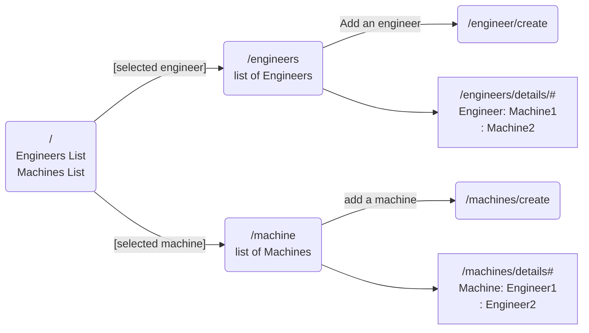

# starting over, moving original code to "original" branch

# Site Map
*footer should have a link back home, to engineers and to machines.

# Dr. SillyStringz's Factory

# make sure to remove comment for your correct dotnet version in Factory.csproj