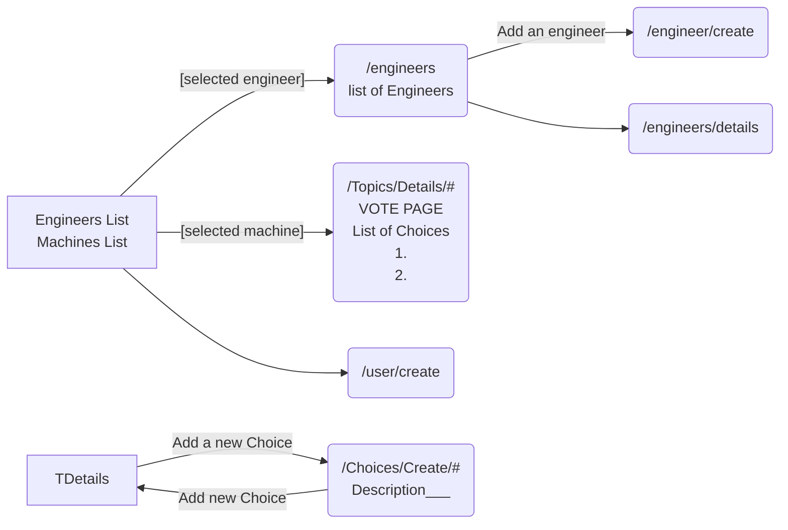

# Site Map
*footer always has a link back home, to engineers and to machines.

```mermaid
flowchart LR
SplashPage[Engineers List<br>Machines List]--"[selected engineer]"-->EngineersIndex("/engineers"<br>list of Engineers)--Add an engineer-->EngineerCreate("/engineer/create") 
EngineersIndex-->EngineersDetails("/engineers/details")
SplashPage--"[selected machine]"-->MachineIndex("/Topics/Details/#"<br>VOTE PAGE<br>List of Choices <br>1.<br>2.)
TDetails--Add a new Choice-->CCreate("/Choices/Create/#"<br>Description___)--Add new Choice-->TDetails
SplashPage-->UserCreate(/user/create<br>)
```

# Dr. SillyStringz's Factory

# make sure to remove comment for correct dotnet version in Factory.csproj